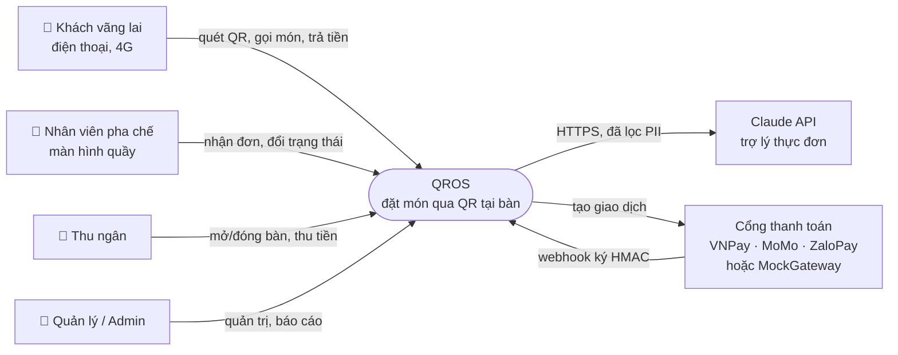
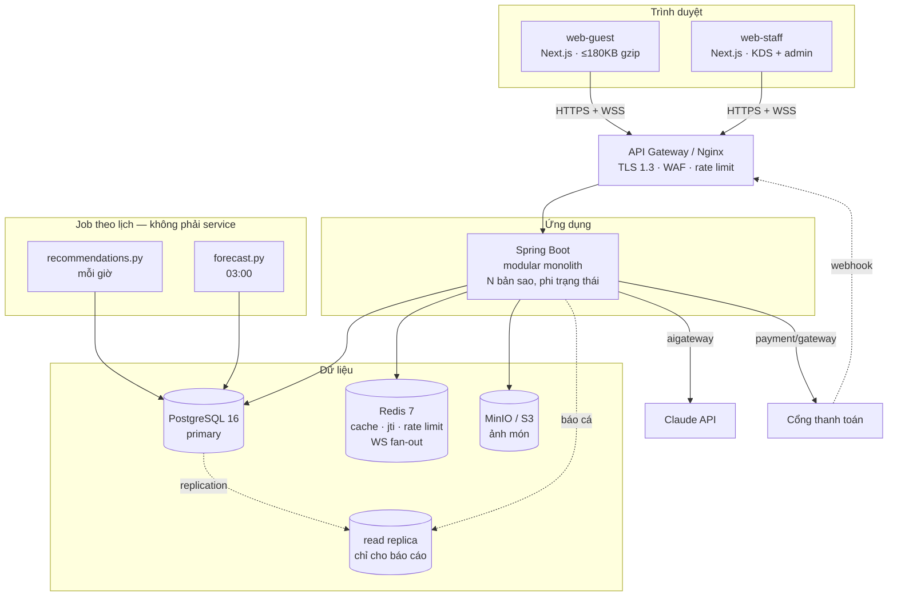
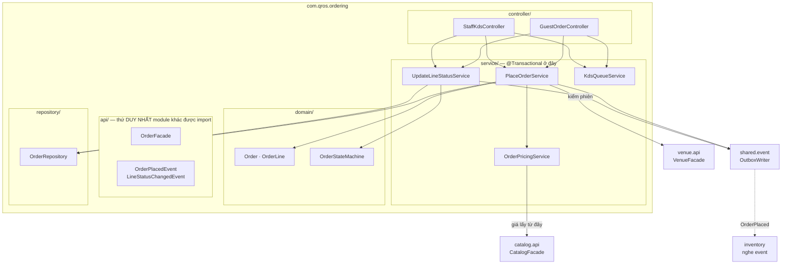
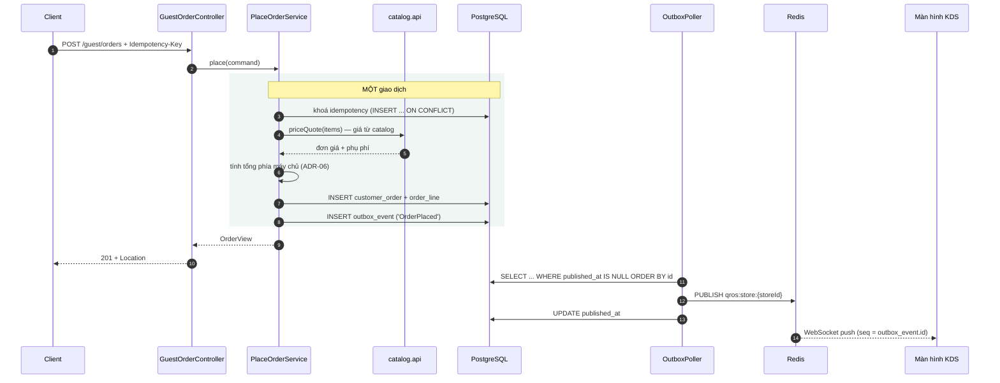
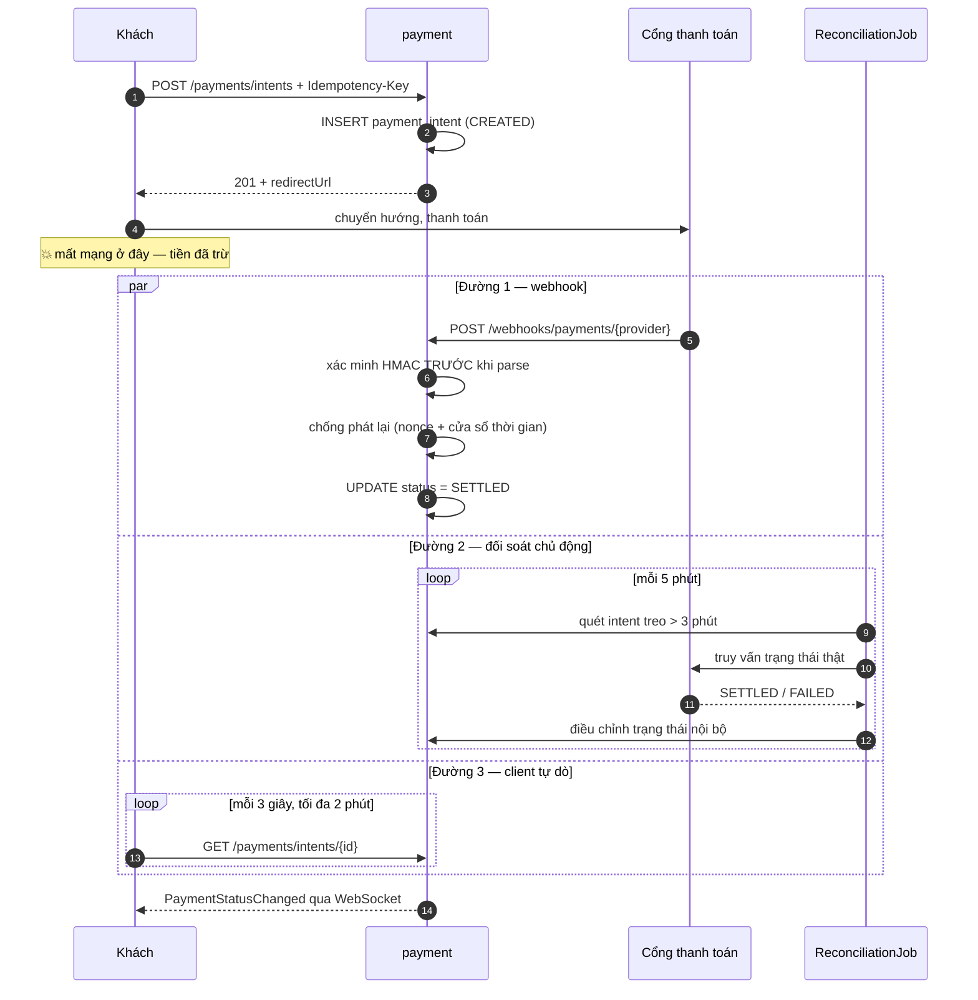
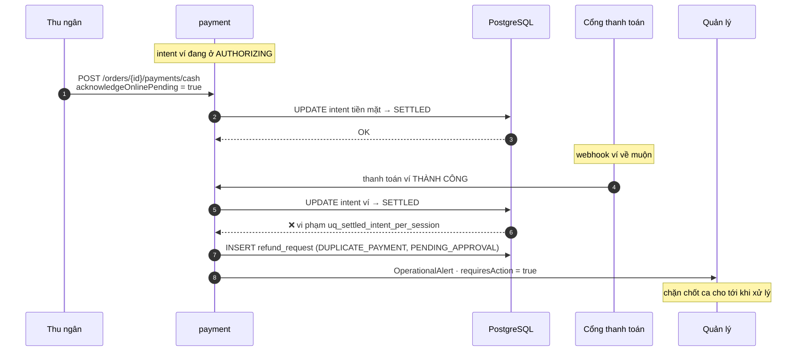
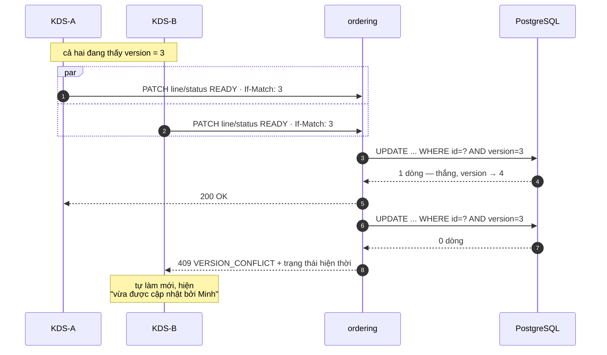
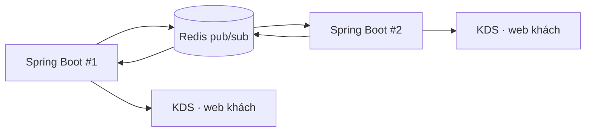
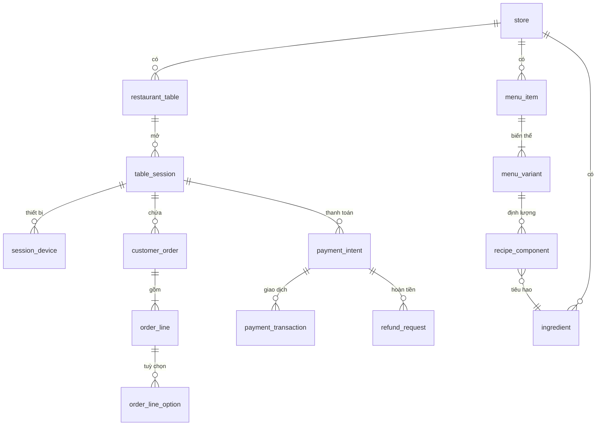

# SDD — Thiết kế hệ thống QROS

| Trường | Giá trị |
|---|---|
| Mã tài liệu | `SDD-QROS-001` |
| Phiên bản | `1.0` |
| Ngày | 2026-09-10 |
| Trạng thái | `DRAFT` |
| Tài liệu mẹ | `docs/PRD.md` v1.1 · `docs/api/openapi.yaml` · `docs/api/asyncapi.yaml` |

> **Phạm vi.** PRD trả lời *cái gì và tại sao*; tài liệu này trả lời *như thế nào*. Nơi hai tài liệu mâu thuẫn, `CLAUDE.md` mục "Bốn chỗ khác với PRD" là trọng tài — SDD này đã theo bản đã sửa: không Kafka, không AI service Python chạy 24/7, không pgvector.
>
> Tài liệu này **không** nhắc lại yêu cầu. Nó tham chiếu bằng mã (`FR-CUS-08`, `EC-01`, `ADR-06`).

---

## 1. Bối cảnh hệ thống



Hệ thống có **đúng hai đường đi ra Internet**, cả hai đều bắt buộc và đều xuất phát từ máy chủ. Trình duyệt khách không bao giờ chạm trực tiếp vào cả hai (`NFR-AI-02`).

---

## 2. Container



**Vì sao không có message broker.** Ở tải đỉnh 120 đơn/phút một chi nhánh (`NFR-PERF-08`), Outbox + poller + Redis pub/sub đủ dùng. Thêm Kafka là thêm một hệ thống phải vận hành, giám sát, sao lưu — mà không giải quyết vấn đề nào đang có.

**Vì sao hai job Python không phải service.** Cả hai đều là tính toán theo lô, ghi kết quả vào bảng Postgres (`item_affinity`, `popular_item_snapshot`, `ingredient_forecast`). Backend chỉ **đọc** các bảng đó. Hệ quả quan trọng: **gợi ý món vẫn hoạt động khi mất hoàn toàn mạng ra Internet** — nó không gọi ai cả, chỉ là một truy vấn SQL.

---

## 3. Component — module `ordering`

Vẽ chi tiết cho module phức tạp nhất; tám module còn lại theo cùng khuôn.



**`OrderPricingService` không tự biết giá.** Nó gọi `catalog.api.CatalogFacade#priceQuote(...)`. Catalog sở hữu giá; ordering sở hữu phép tính tổng đơn. Ranh giới này là lý do đổi bảng giá không phải sửa module ordering.

---

## 4. Bản đồ module và luật phụ thuộc

| Module | Sở hữu | Phát event |
|---|---|---|
| `shared` | Kernel: `Money`, `UuidV7`, outbox, lỗi, bảo mật, idempotency | — |
| `identity` | Tài khoản, vai trò, quyền, ca làm, MFA | `StaffLoggedIn` |
| `venue` | Chi nhánh, bàn, phiên bàn, khoá ký QR | `SessionStarted`, `TableStateChanged` |
| `catalog` | Thực đơn, biến thể, tuỳ chọn, **giá** | `ItemSoldOut`, `PriceChanged` |
| `ordering` | Đơn, dòng đơn, máy trạng thái, hàng đợi KDS | `OrderPlaced`, `LineStatusChanged` |
| `payment` | Ý định, giao dịch, hoàn tiền, đối soát | `PaymentSettled` |
| `inventory` | Nguyên liệu, định lượng, tồn kho | `LowStock`, `IngredientSoldOut` |
| `aigateway` | Trợ lý, gợi ý, rào chắn, hạch toán chi phí | `AiBudgetThresholdReached` |
| `analytics` | Báo cáo (đọc từ read replica) | — |
| `audit` | Nhật ký bất biến | — |

### Luật quan trọng nhất

> Module A không bao giờ import `controller`, `service`, `domain`, hay `repository` của module B. Chỉ được gọi qua `B.api.*`, hoặc lắng nghe domain event của B.

`shared` là ngoại lệ duy nhất — mọi module đều được import nó, và nó không được import module nào.

```java
package com.qros.architecture;

@AnalyzeClasses(packages = "com.qros",
                importOptions = ImportOption.DoNotIncludeTests.class)
class ModuleBoundaryTest {

    /** shared là kernel: không được biết bất kỳ module nghiệp vụ nào. */
    @ArchTest
    static final ArchRule shared_khong_phu_thuoc_nghiep_vu =
        noClasses().that().resideInAPackage("com.qros.shared..")
            .should().dependOnClassesThat()
            .resideInAnyPackage("com.qros.ordering..", "com.qros.payment..",
                                "com.qros.catalog..", "com.qros.venue..",
                                "com.qros.identity..", "com.qros.inventory..",
                                "com.qros.aigateway..", "com.qros.analytics..",
                                "com.qros.audit..")
            .because("kernel phải dùng lại được, không được kéo theo nghiệp vụ");

    /** Ruột của mỗi module chỉ chính module đó được chạm vào. */
    @ArchTest
    static final ArchRule ruot_module_la_rieng_tu =
        moduleInteriorRule(); // ghép một rule cho từng module

    static ArchRule moduleInteriorRule(String module) {
        return classes().that().resideInAnyPackage(
                    "com.qros.%s.controller..".formatted(module),
                    "com.qros.%s.service..".formatted(module),
                    "com.qros.%s.domain..".formatted(module),
                    "com.qros.%s.repository..".formatted(module))
                .should().onlyBeAccessed().byClassesThat(
                    resideInAPackage("com.qros.shared..")
                        .or(new SamePackageRootPredicate(module)))
                .because("module khác chỉ được gọi qua com.qros.%s.api".formatted(module));
    }

    /** Ranh giới giao dịch nằm ở service, không ở controller hay repository. */
    @ArchTest
    static final ArchRule transactional_chi_o_service =
        methods().that().areAnnotatedWith(Transactional.class)
            .should().beDeclaredInClassesThat()
            .resideInAPackage("com.qros.*.service..")
            .because("một giao dịch cho mỗi use case, đặt đúng một chỗ");

    /** Entity JPA không được rò ra ngoài module. */
    @ArchTest
    static final ArchRule entity_khong_ro_ra_api =
        noClasses().that().resideInAPackage("com.qros.*.api..")
            .should().dependOnClassesThat().areAnnotatedWith(Entity.class)
            .because("api chỉ trao đổi DTO, không trao đổi entity");

    /** Không có phụ thuộc vòng giữa các module. */
    @ArchTest
    static final ArchRule khong_phu_thuoc_vong =
        SlicesRuleDefinition.slices()
            .matching("com.qros.(*)..").namingSlices("$1")
            .should().beFreeOfCycles();
}
```

```java
/** Cấm nối chuỗi SQL — OWASP A03. */
@AnalyzeClasses(packages = "com.qros")
class NoRawSqlTest {

    @ArchTest
    static final ArchRule khong_dung_jdbc_tho =
        noClasses().should().accessClassesThat()
            .resideInAnyPackage("java.sql..")
            .because("chỉ dùng truy vấn tham số hoá qua JPA hoặc jOOQ");

    @ArchTest
    static final ArchRule chi_repository_duoc_dung_entitymanager =
        noClasses().that().resideOutsideOfPackage("com.qros.*.repository..")
            .should().dependOnClassesThat()
            .haveFullyQualifiedName("jakarta.persistence.EntityManager");
}
```

> `SamePackageRootPredicate` là `DescribedPredicate<JavaClass>` nhận module đích và so sánh segment
> thứ ba của package. Không thể dùng predicate không tham số ở đây vì nó không biết lớp đích thuộc
> module nào. Hiện thực và test hành vi nằm trong `backend/src/test/java/com/qros/architecture/`.

---

## 5. Ranh giới giao dịch và Outbox

Một giao dịch cho mỗi use case, đặt ở tầng `service`. Sự kiện được ghi **trong cùng giao dịch** với dữ liệu nghiệp vụ (`ADR-05`).



Nếu commit thất bại, **cả đơn lẫn sự kiện đều không tồn tại**. Không bao giờ có chuyện đơn đã lưu mà KDS không nhận được, hay ngược lại.

Cột `outbox_event.id` (`BIGSERIAL`) **chính là** trường `seq` trong `asyncapi.yaml`. Nó cho thứ tự tuyệt đối không phụ thuộc đồng hồ của bất kỳ máy nào, và là cơ sở để client phát lại sau khi kết nối lại.

Kênh Redis đặt tên theo **phạm vi người nghe**, không theo màn hình: `qros:store:{storeId}`,
`qros:session:{sessionId}`, và `qros:global` cho sự kiện không thuộc phạm vi nào. Một kênh chi nhánh
phục vụ cả KDS lẫn sơ đồ bàn; tầng WebSocket lọc tiếp theo loại sự kiện khi ánh xạ sang đích STOMP.
Sự kiện có `session_id` không bao giờ đi vào kênh chi nhánh, vì kênh đó có mọi nhân viên nghe được.

Phong bì bắt buộc có `eventId`, nhưng bảng `outbox_event` của `V1` không có cột riêng cho nó, nên
`eventId` được lưu trong `payload` lúc ghi. Nhờ vậy ID giữ nguyên qua mọi lần phát lại — điều kiện
để client khử trùng lặp. Poller bảo đảm **at-least-once**: phát trước, đánh dấu `published_at` sau,
trong cùng một giao dịch có `FOR UPDATE SKIP LOCKED`.

---

## 6. Bốn luồng khó

### 6.1. Thanh toán, webhook, và đối soát — `EC-01`



Ba đường phục hồi độc lập. **URL trả về của trình duyệt không phải một trong ba** — nó chỉ dùng để đưa khách về giao diện. Quá 15 phút không có kết luận, intent chuyển `EXPIRED` và thu ngân nhận cảnh báo kèm mã tham chiếu.

### 6.2. Thanh toán trùng — `EC-08`



Điểm mấu chốt: hệ thống **không** từ chối im lặng giao dịch thứ hai. Tiền đã vào tài khoản thật, nên nó phải hiện ra dưới dạng một yêu cầu hoàn tiền chờ duyệt.

### 6.3. Hai barista bấm cùng lúc — `EC-06`



Kiểm tra hai lớp, theo thứ tự: **máy trạng thái trước** (`422 INVALID_TRANSITION` nếu chuyển đổi không hợp lệ), **rồi mới tới phiên bản** (`409` nếu lệch). Chuyển đổi không hợp lệ bị từ chối kể cả khi phiên bản còn khớp.

### 6.4. Trợ lý thực đơn — `FR-AI-03`

```mermaid
sequenceDiagram
    autonumber
    participant C as Khách
    participant Ctl as GuestAssistantController
    participant BG as BudgetGuard
    participant PII as PiiRedactor
    participant PA as PromptAssembler
    participant CB as CircuitBreaker
    participant API as Claude API
    participant OG as OutputGuard
    participant UR as UsageRecorder

    C->>Ctl: POST /assistant/messages
    Ctl->>BG: kiểm ngân sách chi nhánh
    alt đã chạm trần
        BG-->>C: 503 AI_UNAVAILABLE → FAQ tĩnh
    end
    Ctl->>PII: lọc chặn-theo-mặc-định (NFR-SEC-26)
    Note over PII: chỉ trường trong danh sách trắng<br/>được đi tiếp; che SĐT/email/thẻ<br/>trong văn bản khách tự gõ
    PII->>PA: nội dung đã sạch
    PA->>PA: prefix = chỉ dẫn + TOÀN BỘ thực đơn<br/>đánh dấu cache (ADR-03, FR-AI-12)
    PA->>CB: gọi
    CB->>API: stream, TTFT ≤ 2.000 ms
    API-->>OG: token stream
    OG->>OG: đối chiếu mọi con số giá với catalog (NFR-SEC-20)
    OG-->>C: SSE tới trình duyệt
    API-->>UR: usage
    UR->>UR: ghi ai_usage_record (FR-AI-14)

    alt lỗi / 429 / timeout
        CB-->>C: 503 AI_UNAVAILABLE
        Note over C: ẩn trợ lý, hiện FAQ tĩnh<br/>khối gợi ý món KHÔNG đổi
    end
```

Khi nhánh lỗi xảy ra, **chỉ trợ lý biến mất**. Gợi ý món đọc từ bảng `item_affinity` nên không bị ảnh hưởng — đó là điều `EC-05` yêu cầu và là lý do hai job Python ghi kết quả xuống Postgres thay vì tính trực tiếp.

---

## 7. Realtime: fan-out và phát lại



Simple broker của Spring STOMP nằm trong bộ nhớ tiến trình nên **không fan-out được** khi có từ hai bản sao. Redis relay là bắt buộc ngay từ bản sao thứ hai — đây là thứ hỏng đúng lúc scale, tức lúc tệ nhất để phát hiện.

**Phát lại sau khi kết nối lại** (`FR-BAR-06`, `NFR-AVL-03`):

1. Client lưu `seq` cuối cùng đã xử lý cho từng kênh.
2. Kết nối lại → gửi `lastSeq` tới `/app/resume`.
3. Máy chủ đọc `outbox_event WHERE store_id = ? AND id > lastSeq ORDER BY id`, phát bù.
4. `lastSeq` quá cũ (ngoài cửa sổ 15 phút) → trả `resyncRequired`, client tải lại toàn bộ qua REST.

Khử trùng lặp bằng `eventId`, vì phát lại có thể chồng lấn với luồng bình thường.

---

## 8. Cache ba tầng

| Tầng | Ở đâu | Nội dung | Vô hiệu hoá khi |
|---|---|---|---|
| L1 | Trình duyệt | `ETag` trên `GET /guest/menu` → `304` | ETag đổi |
| L2 | Redis | Thực đơn đã dựng sẵn theo `storeId` | Nghe `MenuItemPublished`, `PriceChanged`, `ItemSoldOut` |
| L3 | Caffeine, trong tiến trình | Cấu hình chi nhánh, ánh xạ quyền, khoá công khai QR | TTL 60 giây |

Khoá Redis: `menu:v{schemaVer}:{storeId}:{menuVer}`. Đổi thực đơn thì tăng `menuVer` thay vì xoá khoá — tránh cơn bão cache miss (thundering herd) lúc cao điểm.

**Prompt cache của Claude API là tầng thứ tư**, nằm ở phía nhà cung cấp. Prefix phải giữ ổn định từng byte: chỉ dẫn hệ thống rồi tới thực đơn, **không** chèn dấu thời gian hay ID phiên vào prefix. Giám sát `cache_read_input_tokens`; tỷ lệ trúng dưới 80% trong giờ kinh doanh là dấu hiệu prefix đã bị phá vỡ (`FR-AI-12`).

---

## 9. Mô hình dữ liệu

Lược đồ đầy đủ ở `backend/src/main/resources/db/migration/V1__baseline.sql`. Dưới đây là phần lõi.



### Bốn ràng buộc mang tính quyết định

Đây là chỗ một quyết định trong PRD được cưỡng chế ở tầng CSDL thay vì trông chờ vào kỷ luật của tầng ứng dụng:

```sql
-- EC-02: một bàn chỉ có tối đa MỘT phiên đang mở
CREATE UNIQUE INDEX uq_open_session_per_table
    ON table_session (table_id) WHERE status = 'OPEN';

-- EC-08: một phiên chỉ có tối đa MỘT thanh toán đã tất toán
CREATE UNIQUE INDEX uq_settled_intent_per_session
    ON payment_intent (session_id) WHERE status = 'SETTLED';

-- Chống phát lại webhook: mỗi giao dịch của cổng chỉ ghi nhận một lần
CREATE UNIQUE INDEX uq_provider_txn
    ON payment_transaction (provider_txn_id) WHERE provider_txn_id IS NOT NULL;

-- ADR-06: tổng tiền phải nhất quán, không thể ghi một tổng tuỳ ý
CONSTRAINT total_is_consistent
    CHECK (total_amount = subtotal_amount - discount_amount)
```

### Ba quyết định mô hình hoá đáng nêu

**Giá và tên món được sao chép sang `order_line` lúc đặt.** Đổi giá hay đổi tên món về sau không được phép làm thay đổi hoá đơn đã phát hành. Đây cũng là lý do `price_schedule` chỉ có hiệu lực tương lai chứ không sửa đè lịch sử.

**`prep_seconds` là cột sinh (generated column)**, tính từ `ready_at - started_at`. Đặt ở CSDL thay vì tầng ứng dụng để báo cáo hiệu suất không phụ thuộc vào việc mã nguồn có nhớ tính hay không.

**Kết quả của hai job Python nằm ở bảng riêng** (`item_affinity`, `popular_item_snapshot`, `ingredient_forecast`), không trộn vào bảng nghiệp vụ. Backend chỉ đọc. Job có thể chạy lại, ghi đè, hoặc chết mà không ảnh hưởng dữ liệu giao dịch.

---

## 10. Bảo mật ở tầng hiện thực

### Ba chuỗi filter độc lập

```java
@Bean @Order(1)
SecurityFilterChain guest(HttpSecurity http) {
    return http.securityMatcher("/api/v1/guest/**")
        .authorizeHttpRequests(a -> a
            .requestMatchers(POST, "/api/v1/guest/sessions", "/api/v1/guest/sessions/by-code")
                .permitAll()
            .anyRequest().hasAuthority("SCOPE_table_session"))
        .oauth2ResourceServer(o -> o.jwt(j -> j.decoder(tableSessionDecoder())))
        .csrf(CsrfConfigurer::disable)      // token qua header, không qua cookie
        .build();
}

@Bean @Order(2)
SecurityFilterChain staff(HttpSecurity http) { /* cookie + CSRF bật */ }

@Bean @Order(3)
SecurityFilterChain admin(HttpSecurity http) { /* + MFA + allowlist IP */ }
```

Ba `JwtDecoder` khác nhau, ba bộ khoá khác nhau. Token phiên bàn **không thể** dùng cho endpoint nhân viên kể cả khi chữ ký hợp lệ, vì `aud` khác và decoder khác.

### Kiểm tra quyền sở hữu ở cấp đối tượng

Mọi truy vấn của khách phải mang `sessionId` vào mệnh đề `WHERE`, không lọc sau khi đã tải:

```java
// ĐÚNG — ràng buộc nằm trong truy vấn
orderRepository.findByIdAndSessionId(orderId, currentSession.id())
    .orElseThrow(() -> new NotFoundException(ErrorCode.ORDER_NOT_FOUND));

// SAI — tải rồi mới kiểm tra, vẫn lộ thông tin qua thời gian phản hồi
```

Không đủ điều kiện trả `404`, **không** trả `403` — tránh xác nhận sự tồn tại của đơn thuộc bàn khác.

### Xác minh QR — thứ tự sáu bước

Thứ tự quan trọng: kiểm rẻ trước, kiểm đắt sau, và **không bao giờ đọc `alg` từ header của token**.

1. Thuật toán phải đúng `EdDSA` — so với hằng số, không đọc từ token
2. Chọn khoá công khai theo `kid`, chấp nhận khoá hiện tại và liền trước
3. Xác minh chữ ký
4. Bàn tồn tại và thuộc đúng chi nhánh ghi trong token
5. Chi nhánh đang trong giờ mở cửa
6. TOTP nếu bàn bật QR xoay vòng, rồi mới tới giới hạn tần suất

---

## 11. Xử lý lỗi

| Tầng | Ném gì | Thành gì |
|---|---|---|
| `domain` | Ngoại lệ miền (`InvalidTransitionException`) | — |
| `service` | Ngoại lệ ứng dụng (`PriceChangedException`) | — |
| `controller` | Không bắt lỗi | — |
| `shared/error` | `GlobalExceptionHandler` | `application/problem+json` |

Mỗi `ErrorCode` ánh xạ tới đúng một mã HTTP và một thông điệp đã bản địa hoá. **Không bao giờ** đưa stack trace, câu truy vấn, hay tên class vào `detail`. Trường `traceId` luôn có mặt để nhân viên tra cứu.

---

## 12. Những gì chưa quyết

| Hạng mục | Trạng thái |
|---|---|
| Model tier cho trợ lý | Đang mở. Ở quy mô dự án cá nhân, chênh lệch không đáng kể — cứ dùng `claude-opus-5` |
| Tách `analytics` sang read replica từ ngày đầu hay sau | Chờ số liệu thật. Thiết kế đã sẵn sàng cho cả hai |
| Nginx hay Spring Cloud Gateway | Chưa quyết. Không ảnh hưởng thiết kế bên trong |
| Chia hoá đơn (`FR-CUS-15`) | Ưu tiên `C`, chưa mô hình hoá |

---

## 13. Trạng thái kiểm chứng

Kết quả kiểm chứng gần nhất ngày 10/09/2026:

| Hạng mục | Trạng thái |
|---|---|
| `V1__baseline.sql` | ✅ Chạy thành công trên PostgreSQL 16 với `ON_ERROR_STOP=1` · 38 bảng · 0 constraint chưa validate · seed 4 role/53 role-permission |
| Luật ArchUnit | ✅ Biên dịch và chạy thành công trên Java 25 · Gradle 9.1.0 · ArchUnit 1.4.1 · 10/10 test xanh |
| Sequence diagram | ✅ Suy ra từ `openapi.yaml` và `asyncapi.yaml`, chưa có hiện thực đối chiếu |

Lệnh kiểm chứng lại migration khi Docker đã bật:

```bash
docker run --rm -d --name qros-pg -e POSTGRES_PASSWORD=dev -p 5433:5432 postgres:16
sleep 5
docker exec -i qros-pg psql -U postgres -v ON_ERROR_STOP=1 \
  < backend/src/main/resources/db/migration/V1__baseline.sql
docker rm -f qros-pg
```

Lệnh kiểm chứng ArchUnit:

```bash
./gradlew test
```

Chạy lại hai lệnh này sau mọi thay đổi liên quan đến migration hoặc luật kiến trúc.
